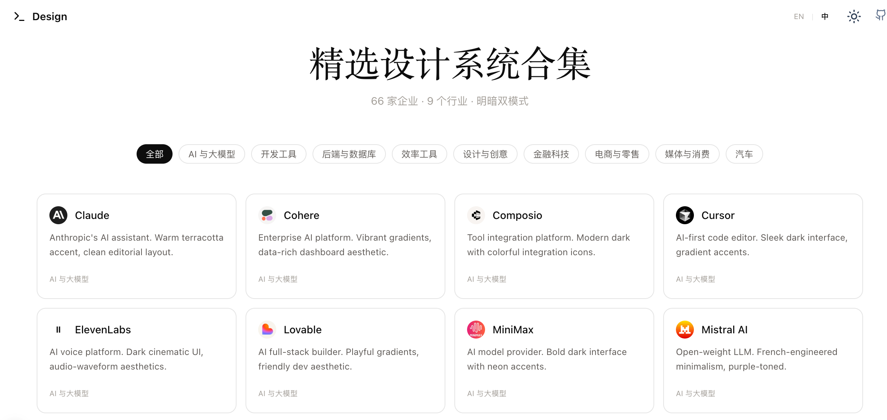
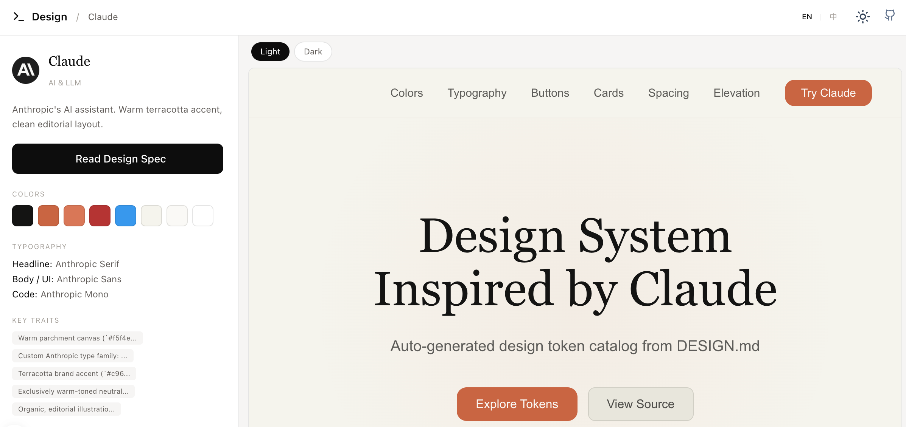

[English](README_en.md) | 中文

# Design — 精选设计系统

基于 [geetdesign.md](https://geetdesign.md) 数据源设计的展示网站。原站收录的设计系统资源很棒。
精选 66 家企业设计系统，提供交互式明暗预览和设计规范文档。

**在线访问：[https://design.false.ltd](https://design.false.ltd)**

## 预览

**首页**



**详情页**



## 什么是 DESIGN.md？

DESIGN.md 是由 [Google Stitch](https://stitch.withgoogle.com/) 引入的设计系统文件格式，专为 AI 编码代理设计。它是一个纯 Markdown 文档，定义了视觉主题、色盘、排版层级、组件样式、布局原则等规则，确保 AI 在生成 UI 时遵循统一的设计规范。只需将 DESIGN.md 文件放入项目根目录，AI 编码代理就能自动理解设计规范，生成一致的 UI。

## 功能特性

- 66 家企业，覆盖 9 大行业分类
- 每个设计系统提供交互式明暗模式 HTML 预览
- 解析展示配色、字体、核心设计特征
- 完整 DESIGN.md 文档查看器，支持一键复制
- 明暗主题切换
- 中英双语支持

## 技术栈

- [Nuxt 4](https://nuxt.com/) + [Nuxt UI](https://ui.nuxt.com/)
- [Tailwind CSS 4](https://tailwindcss.com/) + [@tailwindcss/typography](https://github.com/tailwindcss/typography)
- [marked](https://github.com/markedjs/marked) Markdown 渲染
- [@nuxtjs/i18n](https://i18n.nuxtjs.org/) 国际化

## 快速开始

```bash
pnpm install
pnpm dev
```

访问 [http://localhost:3000](http://localhost:3000)。

## 生产构建

```bash
pnpm build
pnpm preview
```

## 许可证

MIT
